<h3><code>matheus@github ~ $ ./contribuicoes.sh</code></h3>

  

<h3><code>matheus@github ~ $ neofetch</code></h3>

  

<h3><code>matheus@github ~ $ ls ~/projetos</code></h3>

<a href="https://github.com/matheusaoliv/Portfolio---Matheus-Oliveira"><code>portfolio/</code></a>&nbsp;
<a href="https://github.com/matheusaoliv/bicicletario-frontend"><code>bicicletario-frontend/</code></a>&nbsp;
<a href="https://github.com/matheusaoliv/Pokedex-2.0"><code>pokedex-2.0/</code></a>&nbsp;
<a href="https://github.com/matheusaoliv/Megapokedex"><code>megapokedex/</code></a>

<!--
Como funciona
- Toda a animação mora dentro dos .svg (o GitHub remove JS e CSS do README, mas anima SVG carregado via ).
- scripts/make_ascii_svg.py   -> matheus-ascii.svg  (gerado localmente; aceita foto: veja scripts/prep_photo.py)
- scripts/make_info_card.py   -> info-card.svg      (edite INFO no script)
- scripts/fetch_contributions.py + render_heatmap_svg.py -> contrib-heatmap.svg
- .github/workflows/update-profile-art.yml roda tudo isso todo dia e faz commit se algo mudou.
-->
